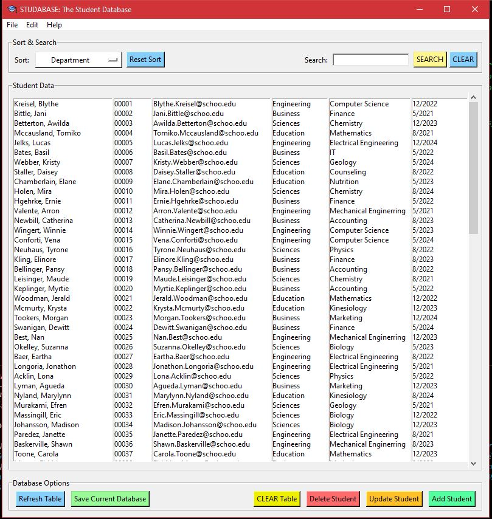
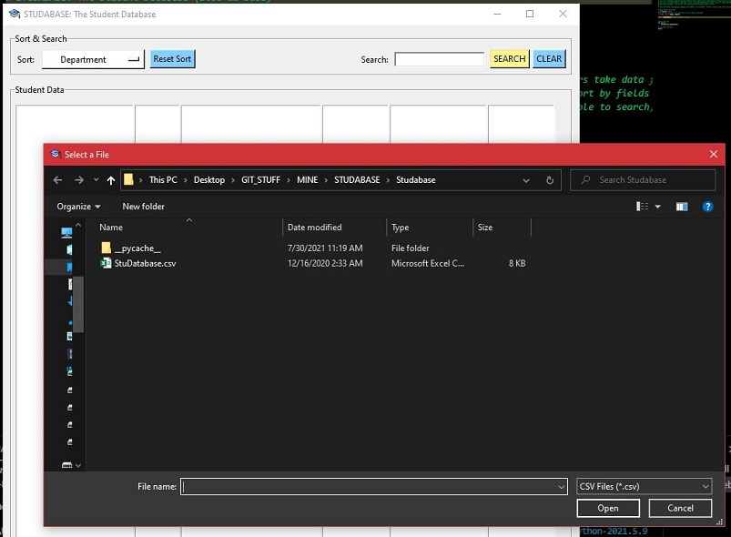
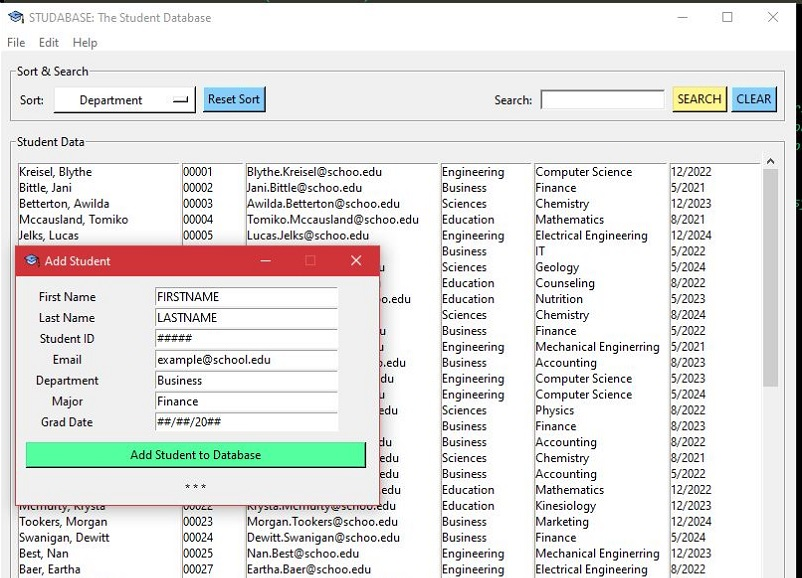
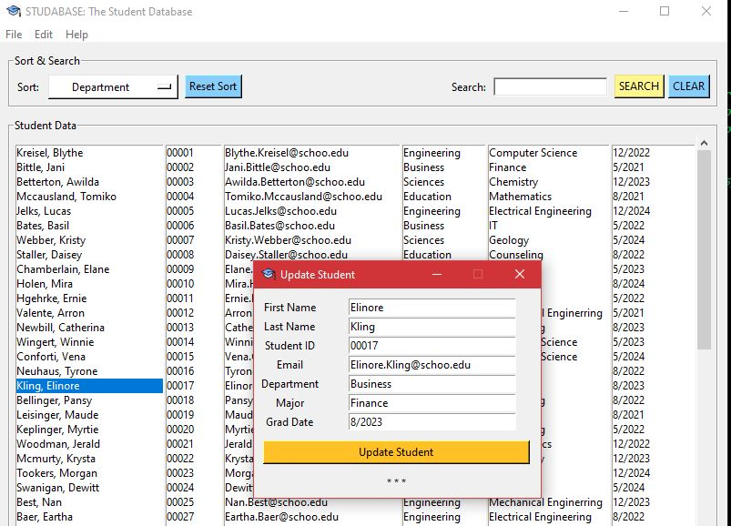

# STUDABASE (Stoo-da-base)
GUI style student database management software. Uses Python3 and tkinter.
_______________________
**Screenshots:**

 
 

_______________________
## Setup & Installation
- Python 3. (https://www.python.org/download/releases/3.0/)


Use the package manager [pip](https://pip.pypa.io/en/stable/) to install packages.

```bash
  Pillow - https://pypi.org/project/Pillow/
      Install trough command line or through Visual Studio's Terminal.
          -> pip install pillow
  Wheel - https://pypi.org/project/wheel/
      Install trough command line or through VS Terminal.
          -> pip install wheel
  Pandas - https://pandas.pydata.org/
      Install trough command line or through VS Terminal.
          -> pip install pandas
  Database - https://pypi.org/project/pyodbc/
      Install trough command line or through VS Terminal.
          -> pip install pyodbc
```

## Usage
+ Studabase can be run through the command line or through an IDE. In this case it was developed in Visual Studio Code on Windows 10.
    - Running in Visual Studio Code:
        1. Open main.py
        2. [Ctrl] + [F5]
    - Running through command line/teminal:
        1. Open terminal and go to directory with "main.py" (Should be the Studabase folder)
        2. In terminal: "python main.py"
        
+ Program will ask you to choose a .csv file first (sample csv file included for testing purposes).
+ After loading use the GUI to edit/add/delete/etc.

## Status
- **CURRENT STATUS:** In progress.

**Implemented**
- Overall GUI design.
- Loading .csv
- Table refresh.
- Table clear.
- Student delete.
- Update student.
- Add student.
- Edit student.

**In Progress**
- SQL implementation.
- Menu options.
- Updating how data is displayed.

**Need to implement**
- Writing to .csv
- Search
- Sort
- Proper user guide. 
- Splash screen.


## Contributing
	- Team SRDG Developers:
    - Santosh Khadka        skhadka.code@gmail.com
    - Reynaldo Ferrari      reynaldoferrari@my.unt.edu
    - Duncan Campbell       duncancampbell@my.unt.edu
    - Gregory Tillotson     gregorytillotson@my.unt.edu

Forks and other contributions are welcome.

## License
[MIT](https://choosealicense.com/licenses/mit/)
